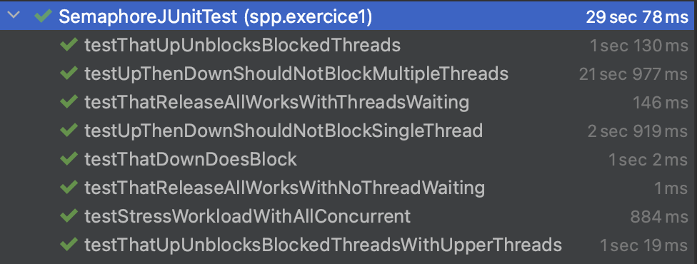

# <p align="center">SPP TP1 & TP2</p>
  
L'objectif de ce TP est d'implémenter un Sémaphore ainsi qu'un mécanisme de "Rendez-vous".


## Excercice 1 
A partir de l'interface fournit sur moodle, nous devons implémenter un sémaphore utilisant les monitors Java. 2 choix s'offrent à nous :

- Utiliser la sémantique Hoare's, cette implémentation utilise ....

- Utiliser la sémantique Mesa, cette implémentation utilise ....

Pour ce TP, et pour une implémentation plus optimal nous utilisons la sémantique .....

Nous sommes partie de l'interface fournit : 
```
public interface SemaphoreInterface {
  public void up();
  public void down() throws InterruptedException;
  public int  releaseAll();
} 
```

Pour déveloper le sémaphore suivant (A noter que le nom du sémaphore est arbitraire):
```
public class Foo implements SemaphoreInterface {
    private int count = 0;
    private int waiting = 0;
    public Foo(){}

    public Foo(int nbPermit){
        count=nbPermit;
    }

    @Override
    public synchronized void up() {
        count++;
        notify();
    }

    @Override
    public synchronized void down() throws InterruptedException {
        if(count <= 0){
            waiting++;
            wait();
        }
        count--;
    }

    @Override
    public synchronized int releaseAll() {
        int nbThread = waiting;
        waiting = 0;
        notifyAll();
        return nbThread;
    }
}
```
Afin de faire en sorte que nos méthodes soient considérées comme des **monitors**, nous utilisons le mot clés **synchronized** dans la signature de la méthode.
Ensuite nous utilisons 2 variables int :
- **count** : permet d'indiquer le nombre de thread que le sémaphore peut prendre.
- **waiting** : permet de nous donner le nombre de thread qui sont en attente.

En utilisant cette deuxième version, nous sommes dans la sémantique... . Afin d'utiliser l'autre sémantique, il aurait fallut implementer une *LinkedList*. 

Avec l'implémentation ci-dessus, tout les tests fournit passent :



## Excercice 2
L'objectif de cet exercice est d'apprendre à utiliser le mécanisme de synchronisation de rendez-vous fourni par Java en utilisant la classe Exchanger<V>. On va mettre en place un petit programme multi-threadé dans lequel deux threads (appelés "Alice" et "Bob") échangent deux objets string ("Ping" et "Pong") à plusieurs reprises. Le but est de comprendre comment utiliser la classe Exchanger pour synchroniser les échanges entre les deux threads.

Voilà l'implementation que nous avons proposé :
```
public class Main {
    static Exchanger<String> exchangeur = new Exchanger<>();

    public static void main(String[] args) {
        Thread alice = new Thread(new Alice());
        Thread bob = new Thread(new Bob());
        alice.start();
        bob.start();
    }

    public static class Bob implements Runnable {
        private String name = "Bob";
        private String value = "Pong";
        private int iteration = 0;

        public void run() {
            for (int i = 0; i<=2; i++) {
                System.out.println("Iteration: " + iteration + " " + name + " has " + value);
                System.out.println("Iteration: " + iteration + " " + name + " going to sleep");
                Random r = new Random();
                try {
                    sleep(r.nextInt(5000));
                } catch (InterruptedException e) {
                    throw new RuntimeException(e);
                }
                System.out.println("Iteration: " + iteration + " " + name + " ready to exchange");
                try {
                    value = exchangeur.exchange(value);
                } catch (InterruptedException e) {
                    throw new RuntimeException(e);
                }
                iteration++;
            }
        }
    }

    public static class Alice implements Runnable{
        private String name = "Alice";
        private String value = "Ping";
        private int iteration = 0;

        public void run() {
            for (int i = 0; i <= 2; i++) {
                System.out.println("Iteration: " + iteration + " " + name + " has " + value);
                System.out.println("Iteration: " + iteration + " " + name + " going to sleep");
                Random r = new Random();
                try {
                    sleep(r.nextInt(5000));
                } catch (InterruptedException e) {
                    throw new RuntimeException(e);
                }
                System.out.println("Iteration: " + iteration + " " + name + " ready to exchange");
                try {
                    value = exchangeur.exchange(value);
                } catch (InterruptedException e) {
                    throw new RuntimeException(e);
                }
                iteration++;
            }
        }
    }
}
```
Nous avons donc 2 classes statiques dans notre main qui représente Alice et Bob qui ressemble à cela :

```
public static class Alice implements Runnable {
    private String name = "Alice";
    private String value = "Ping";
    private int iteration = 0;

    public void run() {
        for (int i = 0; i <= 2; i++) {
            System.out.println("Iteration: " + iteration + " " + name + " has " + value);
            System.out.println("Iteration: " + iteration + " " + name + " going to sleep");
            Random r = new Random();
            try {
                sleep(r.nextInt(5000));
            } catch (InterruptedException e) {
                throw new RuntimeException(e);
            }
            System.out.println("Iteration: " + iteration + " " + name + " ready to exchange");
            try {
                value = exchangeur.exchange(value);
            } catch (InterruptedException e) {
                throw new RuntimeException(e);
            }
            iteration++;
        }
    }
}
```
Chaque classe a son propre nom et sa propre valeur. Nous avans ensuite la méthode **run()** qui vient faire 3 fois les prints, **sleep()** et ensuite appelé l'échangeur.
La classe Bob est similaire part le nom, la valeur et les prints qui sont différents.

Enfin nous avons notre main qui ressemble à sa :
```
public static void main(String[] args) {
    Thread alice = new Thread(new Alice());
    Thread bob = new Thread(new Bob());
    alice.start();
    bob.start();
}
```
On vient juste déclarer nos threads et les appelés. Une fois exécuter, on obtient l'affichage suivante :
```
Iteration: 0 Alice has Ping
Iteration: 0 Bob has Pong
Iteration: 0 Bob going to sleep
Iteration: 0 Alice going to sleep
Iteration: 0 Alice ready to exchange
Iteration: 0 Bob ready to exchange
Iteration: 1 Bob has Ping
Iteration: 1 Bob going to sleep
Iteration: 1 Alice has Pong
Iteration: 1 Alice going to sleep
Iteration: 1 Alice ready to exchange
Iteration: 1 Bob ready to exchange
Iteration: 2 Alice has Ping
Iteration: 2 Bob has Pong
Iteration: 2 Bob going to sleep
Iteration: 2 Alice going to sleep
Iteration: 2 Bob ready to exchange
Iteration: 2 Alice ready to exchange
```
Ce qui est proche de l'affichage de ce qu'on doit obtenir.
